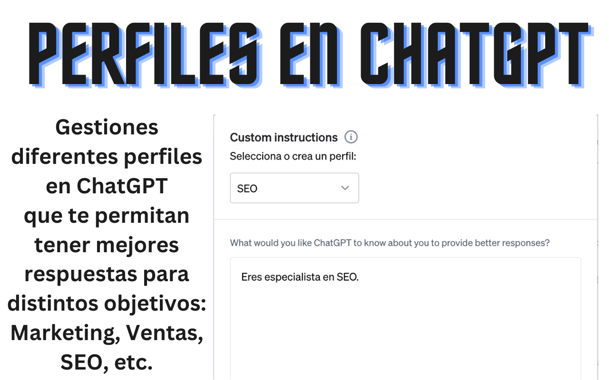

# Perfiles para ChatGPT

## Descripción

**Perfiles para ChatGPT** mejora la experiencia en ChatGPT al permitir la gestión intuitiva de perfiles de usuario. Sin comprometer tu privacidad, todos los datos se almacenan directamente en tu navegador.

## Características Principales

- **Gestión de Perfiles**: Crea y administra diferentes perfiles de usuario para ChatGPT.
- **Privacidad Primero**: Ningún dato sale de tu navegador. Todo se guarda localmente.
- **Interfaz Intuitiva**: Diseñada para ser fácil de usar, permitiendo una rápida adaptación.

## Instalación

1. Dirígete al [Google Chrome Store](https://chrome.google.com/webstore/detail/perfiles-para-chatgpt/ikgecgnenemcaeoehngiiaeinefnhjmj)
2. Haz clic en "Agregar a Chrome" para instalar la extensión.
3. ¡Listo! Ahora puedes usar la extensión directamente en ChatGPT.

## Preguntas Frecuentes

- **¿Es gratis?**  
  Sí, la extensión es completamente gratuita.

- **¿Dónde se guardan los datos de los perfiles?**  
  Todos los datos se guardan en tu propio navegador y no se transmiten ni almacenan en ningún otro lugar.

## Colaborar

Si deseas mejorar la extensión o tienes sugerencias, ¡te invito a colaborar! Puedes abrir un `issue` o enviar un `pull request` directamente en este repositorio.

## Apoya el Proyecto

Si esta extensión te ha sido útil, ¡considera dejar [una reseña de 5 estrellas en el Chrome Store](https://chrome.google.com/webstore/detail/perfiles-para-chatgpt/ikgecgnenemcaeoehngiiaeinefnhjmj)! Si quieres apoyarnos aún más, [¡regáme un café!](https://www.paypal.com/donate/?business=QERMZ422SASX6&no_recurring=0&item_name=Gracias+por+apoyar+mi+trabajo%21&currency_code=USD)
